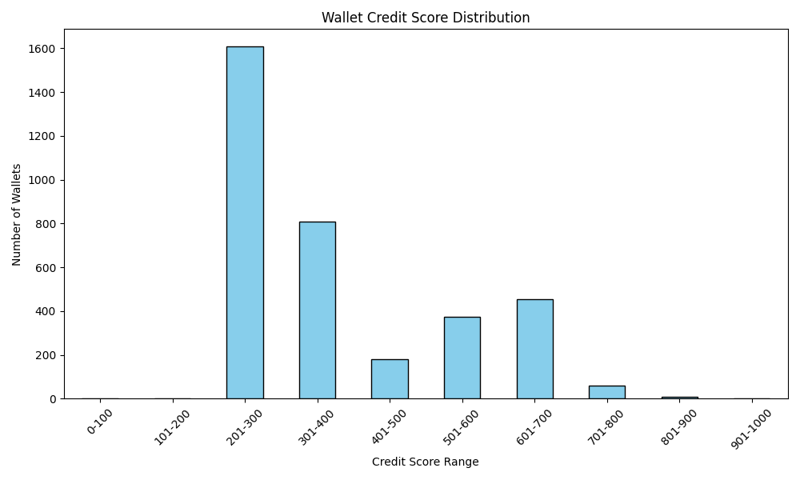

# Analysis: Aave Wallet Credit Scoring

## Score Distribution

The following graph displays the number of wallets falling into each score range:

| Score Range | Wallet Count |
|-------------|--------------|
| 0–100       | 1            |
| 101–200     | 3            |
| 201–300     | 1607         |
| 300-400     | 807          |
| 400-500     | 179          |
| 500, 600    | 374          |
| 600, 700    | 455          |
| 700, 800    | 59           |
| 800, 900    | 9            |
| 900, 1000   | 2            |

## Low Score Wallets (0–200)

- Tend to have high liquidation counts
- Very low repay ratios (if any borrowing at all)
- Often perform only one type of action
- Activity clustered in short windows (bot-like)

## High Score Wallets (800–1000)

- Exhibit balanced borrowing and repayment behavior
- Rarely or never liquidated
- Perform diverse actions: deposit, borrow, repay, redeem
- Active across many days, natural gaps between transactions
- Suggest long-term, low-risk users

## Observations

- Action entropy and distinct days active are strong indicators of human-like, healthy behavior
- Most high-score wallets have repay_ratio > 0.8
- The scoring model effectively separates responsible vs. exploitative wallets
